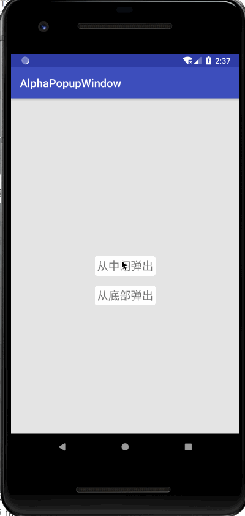

# EkPopWindow #

一款通用弹窗，免去写PopupWindow的一些烦恼

## Gradle ##

在你的项目中添加

```groovy
repositories {
        maven { url "https://jitpack.io" }
    }
```

然后添加依赖

```groovy
dependencies {
        implementation 'com.github.ekwongchum:ekpopwindow:1.0.0'
    }
```

## 开始使用 ##

继承EkPopWindow类，重写setBuilderConfig方法实现你的自定义，例如：

```java
public class CenterPopWindow extends EkPopWindow {

    public CenterPopWindow(Context context, View decorView) {
        super(context, R.layout.popwindow_center, decorView);
    }
}
```

如果需要对具体的view进行处理，在findView()方法中进行处理，例如：

```java
@Override
protected void findView(CustomPopWindow customPopWindow) {
    mTvGallery = customPopWindow.findViewById(R.id.tvGallery);
    mTvCamera = customPopWindow.findViewById(R.id.tvCamera);
    mTvCancel = customPopWindow.findViewById(R.id.tvCancel);
    mTvGallery.setText("Chose Photo");
    mTvCamera.setText("Take Photo");
}
```

如果需要添加监听器，在addListener() 方法中进行添加，例如：

```java
@Override
protected void addListener() {
    mTvGallery.setOnClickListener(new View.OnClickListener() {
        @Override
        public void onClick(View v) {
            mWindowClickListener.onGalleryClick();
            dismiss();
        }
    });

    mTvCamera.setOnClickListener(new View.OnClickListener() {
        @Override
        public void onClick(View v) {
            mWindowClickListener.onCameraClick();
            dismiss();
        }
    });

    mTvCancel.setOnClickListener(new View.OnClickListener() {
        @Override
        public void onClick(View v) {
            mWindowClickListener.onCancelClick();
            dismiss();
        }
    });
}
```

如果需要配置动画，可以在setBuilderConfig中进行设置：

```java
@Override
protected void setBuilderConfig(CustomPopWindow.Builder builder) {
    // 设置动画周期
    builder.setDuration(mContext.getResources().getInteger(R.integer.anim_duration_short))
            //设置外层颜色
            .setOutSideColor(mContext.getResources().getColor(R.color.transparent_fifty_percent))
            //外层是否可点击
            .setOutSideTouchable(true)
            //设置动画类型
            .setAnimationType(PopAnimation.POP_FROM_BOTTOM);
}
```

目前支持的动画类型有：

- 中间淡出  PopAnimation.FADE_OUT_CENTER
- 底部弹起  PopAnimation.POP_FROM_BOTTOM

## 效果图 ##



## 关于 ##

一个日常工作中的小代码，有错误请指出。

项目位于https://github.com/EKwongChum/EkPopWindow，

欢迎fork和star，如果你有更好的建议，欢迎提PR。